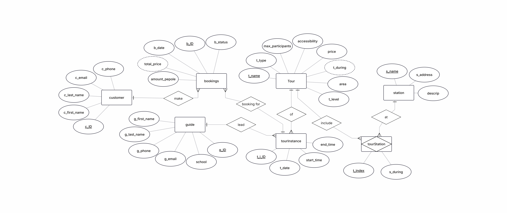
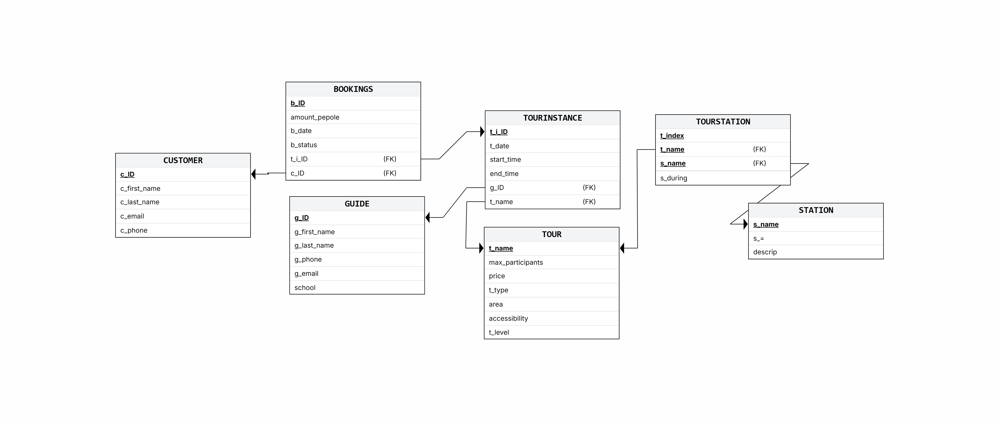
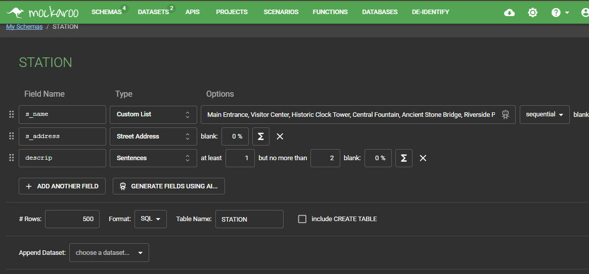
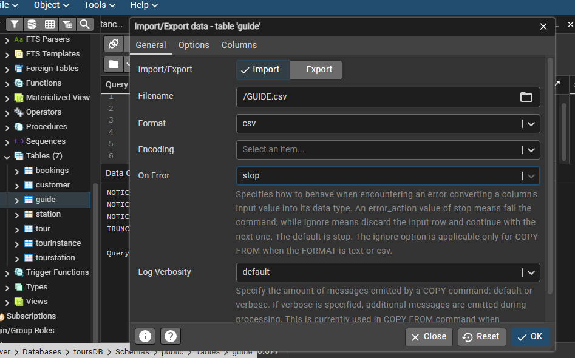
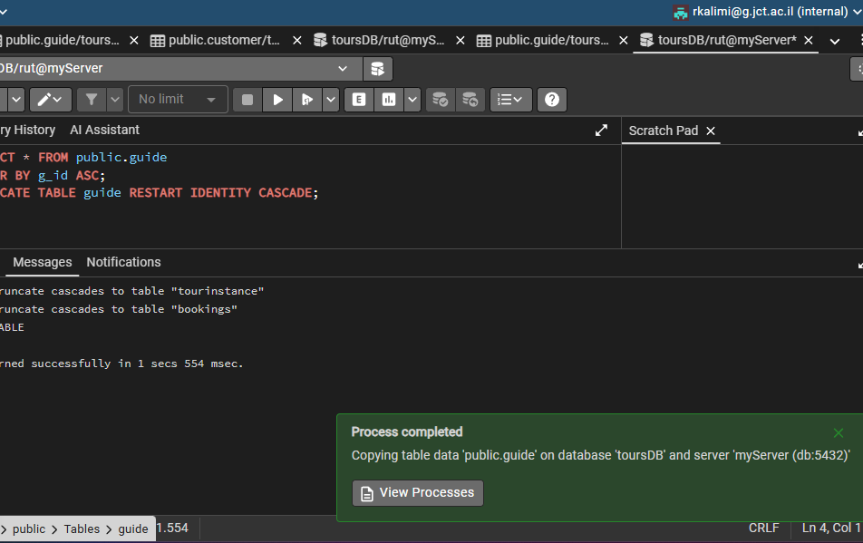
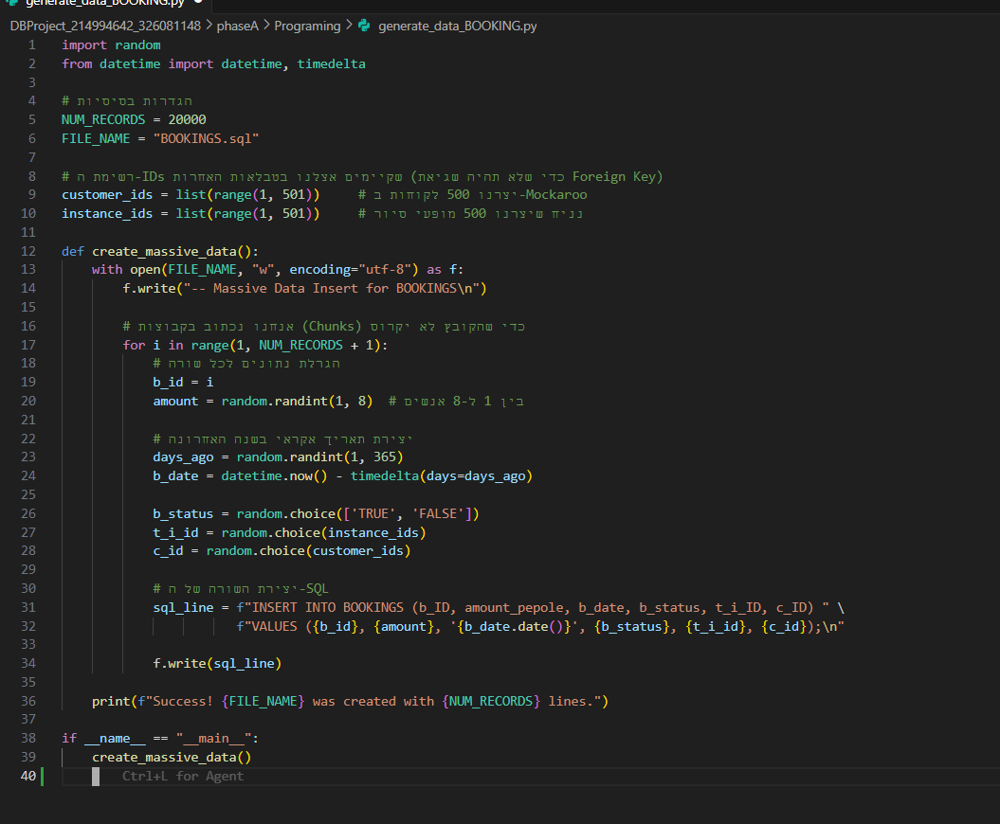
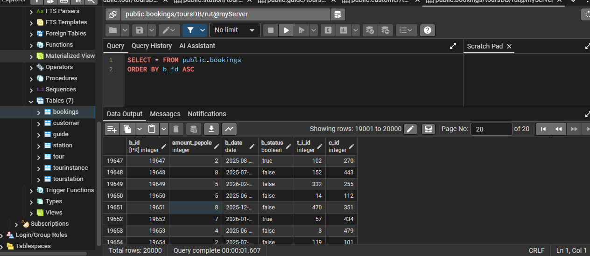
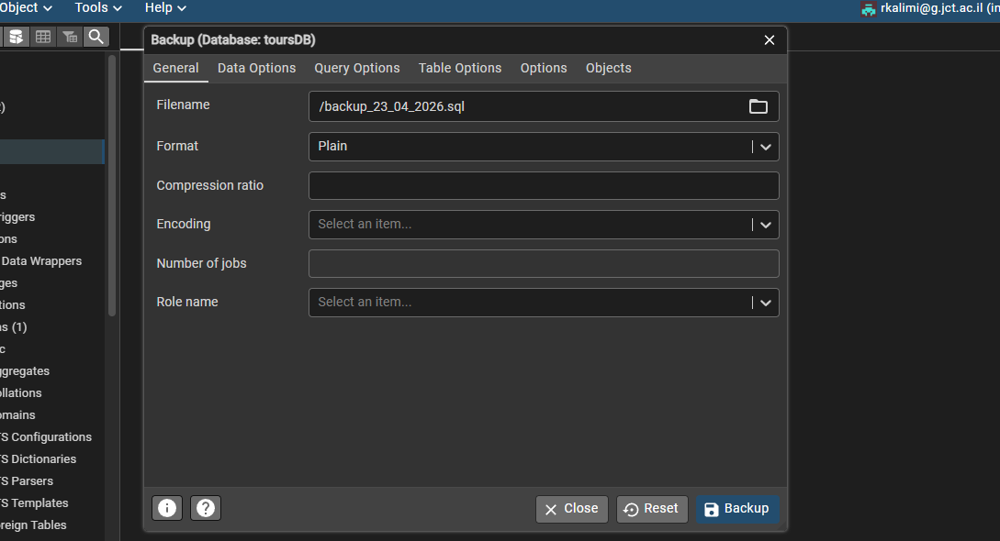
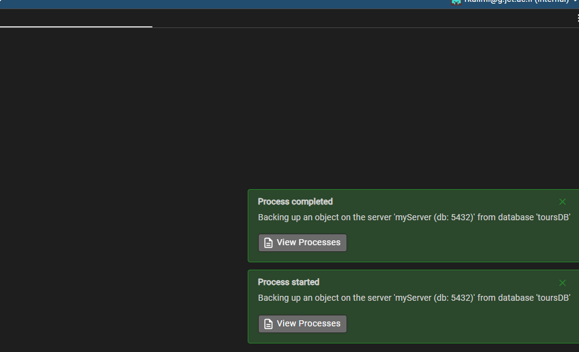
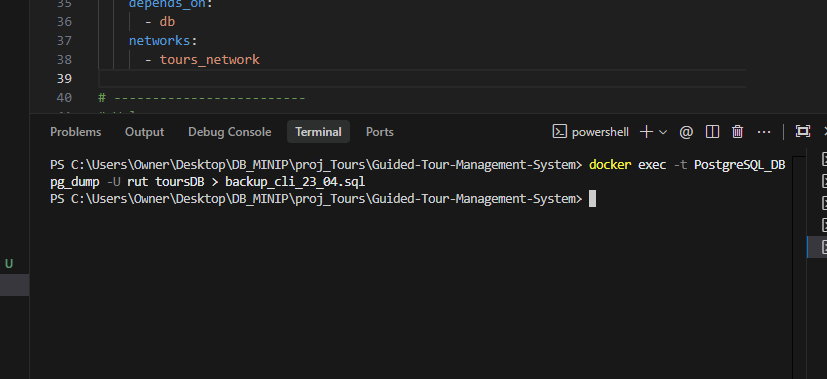

# Guided-Tour-Management-System
🌍 SweeTour - Tour management system
Rut Kalimi and Shirel Farzam
## Table of Contents  
- [Phase 1: Design and Build the Database](#phase-1-design-and-build-the-database)  
  - [Introduction](#introduction)
  - [Images from the site](#images-from-the-site)  
  - [ERD (Entity-Relationship Diagram)](#erd-entity-relationship-diagram)  
  - [DSD (Data Structure Diagram)](#dsd-data-structure-diagram)  
  - [SQL Scripts](#sql-scripts)  
  - [Data](#data)
  - [Backup](#backup)  
- [Phase 2: Queries](#phase-2-Queries)
- [Phase 3: Integrates](#phase-3-Integrates)
- [Phase 4: PL/pgSQL](#phase-4-plpgsql)

# Phase 1: Design and Build the Database  

### Introduction
SweeTour is an advanced platform designed for planning and managing guided tours, streamlining the connection between tour operators, guides, and customers. The system offers a comprehensive solution for the entire "tour experience"—from building detailed routes with specific time stations and geographic locations, to managing guide assignments and tracking real-time bookings and revenue.  

### Purpose of the Database
This database serves as a structured and reliable solution for tour management systems to:
Organize tour routes based on geographic areas, pricing, and difficulty levels.
Manage station sequences by linking specific points of interest to tours with chronological indexes.
Maintain station-tour relationships, ensuring a smooth flow of information regarding site visits.
Store site specifications, including accessibility details and duration of stay for each station.
Track essential tour data such as participant limits, pricing strategies, and historical tour instances.

### Potential Use Cases
Tour Operators and Administrators can use this database to efficiently design new routes, manage site allocations, and set pricing models.
Tour Guides can track their assigned tour instances, view the specific sequence of stations, and prepare for site-specific durations.
Travelers and Clients can explore available tours based on their preferred area, budget, and accessibility requirements.
Operational Staff can use the system for record-keeping of tour executions, scheduling, and resource management.

### images-from-the-site
A folder containing images from our system built on the site.
[Click here to view the images](DBProject_214994642_326081148/phaseA/images)

תיאור פרטי תחנה

.png)

פרטי מופע סיור 

.png)

פרטי סיור כללי

.png)

נראות הדשבורד- מסך כללי

.png)

רשימת ההזמנות

.png)

רשימת מדריכים

.png)

רישום לקוח

.png)

הזמנה חדשה של סיור

.png)

###  ERD (Entity-Relationship Diagram)    

###  DSD (Data Structure Diagram)   

###  SQL Scripts  
Provide the following SQL scripts:  
- **Create Tables Script** - The SQL script for creating the database tables is available in the repository:

🗒️ **[View `create_tables.sql`](init-db/2createTables.sql)**
 - **Insert Data Script** - The SQL script for insert data to the database tables is available in the repository:  

🗒️ **[View `insert_tables.sql`](init-db/3insertTables.sql)**  
 
- **Drop Tables Script** - The SQL script for droping all tables is available in the repository:  

🗒️ **[View `drop_tables.sql`](init-db/1dropTables.sql)**  

- **Select All Data Script**  - The SQL script for selectAll tables is available in the repository: 

🗒️ **[View `selectAll_tables.sql`](init-db/4selectAll.sql)**  

###  Data  
#### 1️⃣ First Method: Direct SQL Scripts (Mockaroo Export)
#### Tool: using [mockaro](https://www.mockaroo.com/) to create csv file
We exported structured data from Mockaroo as .sql files containing INSERT statements. These scripts were integrated into our workspace and executed to populate the core tables.

#####  Entering a data to STATION table
- station id scope: 1-500
- 🗒️[View `STATION.sql`](DBProject_214994642_326081148/phaseA/mockarooFiles/STATION.sql)

#### 2️⃣ Second Method: CSV Import via pgAdmin
#### Tool: import csv files (that generated in mockaroo)
We generated raw data in CSV format and utilized the pgAdmin Import Tool. This allowed us to map spreadsheet data directly to our existing database schema efficiently.

#####  Entering a data to CUSTOMER table
#####  Entering a data to TOUR table
- tour id scope 1-500
🗒️ **[View `TOUR.csv`](DBProject_214994642_326081148/phaseA/mockarooFiles/TOUR.csv)**

🗒️ **[View `GUIDE.csv`](DBProject_214994642_326081148/phaseA/generateData/GUIDE.csv)**

#### 3️⃣ Third method: Custom Python Scripting & SQL Generation
#### Tools: using python to create csv file
We developed a Python script to handle complex data logic, such as the many-to-many relationship between tours and stations. This script automatically generated precise SQL INSERT statements, ensuring data integrity and consistency across the database.

### Backup 
-   Clicking on the backup files (of the two methods required):  

[backup from pgAdmin (UI)](DBProject_214994642_326081148/phaseA/backups/backup_23_04_2026.sql)

[backup from CLI](DBProject_214994642_326081148/phaseA/backups/backup_cli_23_04.sql)

-Pictures from the backup creation process:

# Phase 2: Queries

## SELECT queries:
 🎭- next to the duplicate queries.
<!-- -->

### Query 1: Top Hiking Guides
מחזיר את השם של המדריך ואת מספר סיורי ההליכה שהוא העביר
רק עבור מדריכים שהרדיכו יותר מ5 סיורי הליכה

SQL Code:
      
      SELECT g.g_first_name, g.g_last_name, COUNT(ti.t_i_ID) AS hiking_tours_count
      FROM GUIDE g
      JOIN TOURINSTANCE ti ON g.g_ID = ti.g_ID
      JOIN TOUR t ON ti.t_name = t.t_name
      WHERE t.t_type = 'Hiking'
      GROUP BY g.g_ID, g.g_first_name, g.g_last_name
      HAVING COUNT(ti.t_i_ID) > 5
      ORDER BY hiking_tours_count DESC;

### 🎭 Query 2: Accessible Tour Guides
מחזיר את השם פרטי ושם משפחה של המדריך ומספר הטלפון שלו
רק עבור מדריכים שהעבירו סיורים נגישים

SQL Code:
      
    SELECT DISTINCT g.g_first_name, g.g_last_name, g.g_phone
    FROM GUIDE g
    JOIN TOURINSTANCE ti ON g.g_ID = ti.g_ID
    JOIN TOUR t ON ti.t_name = t.t_name
    WHERE t.accessibility = 1
    ORDER BY g.g_last_name ASC;

    -- פחות יעילה
    SELECT g_first_name, g_last_name, g_phone
    FROM GUIDE
    WHERE g_ID IN (
        SELECT ti.g_ID 
        FROM TOURINSTANCE ti
        WHERE ti.t_name IN (
            SELECT t_name FROM TOUR WHERE accessibility = 1
        )
    );

בבדיקת זמני הריצה שביצענו, ניכר הבדל משמעותי בין שתי הצורות:

צורה א' (JOIN): זמן ריצה של כ-345ms.

צורה ב' (Nested IN): זמן ריצה של כ-4,859ms (מעל 4 שניות).

מדוע צורה א' (JOIN) יעילה יותר במקרה זה?

אופטימיזציה של ה-Join: בשימוש ב-JOIN, מנוע בסיס הנתונים (Query Optimizer) יכול לתכנן מסלול גישה יעיל שמשלב את הטבלאות במקביל, תוך שימוש באינדקסים על המפתחות הזרים (g_id, t_name).

עלות הקינון: בצורה ב', בסיס הנתונים נדרש לבנות "קבוצות זמניות" (Intermediate result sets) עבור כל רמת קינון. בטבלאות גדולות, הפעולה של בדיקת IN מול רשימה ארוכה שנוצרת בזמן אמת היא הרבה יותר "יקרה" מבחינת משאבי עיבוד מאשר חיבור טבלאות ישיר.

מסקנה: למרות שצורה ב' לעיתים קריאה יותר לאנשים מסוימים, היא איטית משמעותית במקרה של ריבוי נתונים, ולכן נעדיף להשתמש ב-JOIN (צורה א') או ב-EXISTS בייצור

### Querie 3
מחזיר את השם של הסיור ואת משך הסיור
רק עבור סיורים שהמשך שלהם הוא 2 שעות לפחות

SQL Code:
      
SELECT t.t_name,
       EXTRACT(YEAR FROM ti.t_date) AS tour_year,
       EXTRACT(MONTH FROM ti.t_date) AS tour_month,
       EXTRACT(DAY FROM ti.t_date) AS tour_day,
       t.t_duration
FROM TOUR t
JOIN TOURINSTANCE ti ON t.t_name = ti.t_name
WHERE t.t_duration >= 2
ORDER BY tour_year, tour_month, tour_day;

### Querie 4
וגם את שם המדריך מחזיר את השם של הסיור ואת שעת ההתחלה והסיום שלו 
רק עבור סיורים שמתחילים אחרי 18:00 

SQL Code:
      
SELECT t_name, start_time, end_time, g.g_first_name, g.g_last_name
FROM TOURINSTANCE t 
JOIN GUIDE g ON g.g_ID = ti.g_ID
WHERE start_time >= '18:00:00'
ORDER BY start_time ASC;

### Querie 5
מחזיר את השם פרטי ושם משפחה של המדריך ואת מספר הסיורים המקצועיים שהוא העביר
רק עבור מדריכים שהעבירו יותר מ2 סיורים מקצועיים

SQL Code:
      
SELECT g.g_first_name, g.g_last_name, COUNT(ti.t_i_ID) AS professional_tours
FROM GUIDE g
JOIN TOURINSTANCE ti ON g.g_ID = ti.g_ID
JOIN TOUR t ON ti.t_name = t.t_name
WHERE t.t_level = 5 AND t.price > 100
GROUP BY g.g_ID, g.g_first_name, g.g_last_name
HAVING COUNT(ti.t_i_ID) >= 2;

### 🎭Querie 6
מחזיר את השם פרטי ושם משפחה של הלקוח ואת מספר הטלפון שלו
רק עבור לקוחות שהזמינו 25 סיורים לא משולמים

SQL Code:
      
SELECT c.c_ID, c.c_first_name, c.c_last_name, c.c_phone
FROM CUSTOMER c
JOIN BOOKINGS b ON c.c_ID = b.c_ID
WHERE b.b_status = FALSE
GROUP BY c.c_ID, c.c_first_name, c.c_last_name, c.c_phone
HAVING COUNT(b.b_id) > 25
ORDER BY c.c_last_name;

-- פחות יעילה
SELECT c.c_first_name, c.c_last_name, c.c_phone
FROM CUSTOMER c
WHERE (
    SELECT COUNT(*)
    FROM BOOKINGS b
    WHERE b.c_ID = c.c_ID AND b.b_status = FALSE
) > 25
ORDER BY c_last_name;

צורה א' (JOIN): זמן ריצה של 1.73 שניות.

צורה ב' (Subquery): זמן ריצה של 13.3 שניות.

מדוע צורה א' יעילה יותר?

עיבוד קבוצתי: בצורה א', בסיס הנתונים מחבר את הטבלאות פעם אחת ומבצע ספירה מרוכזת על כל הנתונים יחד.

עיבוד שורתי: בצורה ב', בסיס הנתונים נאלץ להריץ את תת-השאילתא מחדש עבור כל שורה ושורה בטבלת הלקוחות. פעולה חוזרת זו גורמת לעיכוב משמעותי ככל שכמות הלקוחות בטבלה גדלה.

מסקנה: צורה א' עדיפה לשימוש במערכת כיוון שהיא מהירה פי כמה ומבצעת חישוב מאוחד במקום חישובים חוזרים.

### 🎭Querie 7
מחזיר את המדריכים בסיורים בחודשי הקיץ 

SQL Code:
      
SELECT EXTRACT(MONTH FROM t_date) AS tour_month, 
       COUNT(*) AS total_instances,
       g.g_first_name AS guide_name, 
       g.g_phone AS guide_phone
FROM TOURINSTANCE ti
JOIN GUIDE g ON ti.g_ID = g.g_ID
WHERE EXTRACT(MONTH FROM t_date) IN (6, 7)
  AND EXTRACT(YEAR FROM t_date) = 2026
GROUP BY EXTRACT(MONTH FROM t_date), g.g_first_name, g.g_phone;

-- פחות יעילה
SELECT DISTINCT
    EXTRACT(MONTH FROM t1.t_date) AS tour_month,
    (SELECT COUNT(*) 
     FROM TOURINSTANCE t2 
     WHERE EXTRACT(MONTH FROM t2.t_date) = EXTRACT(MONTH FROM t1.t_date)
       AND t2.g_ID = t1.g_ID) AS total_instances,
    (SELECT g_first_name 
     FROM GUIDE g 
     WHERE g.g_ID = t1.g_ID) AS guide_name,
    (SELECT g_phone 
     FROM GUIDE g 
     WHERE g.g_ID = t1.g_ID) AS guide_phone
FROM TOURINSTANCE t1
WHERE EXTRACT(MONTH FROM t1.t_date) IN (6, 7)
  AND EXTRACT(YEAR FROM t1.t_date) = 2026;

צורה א' (JOIN + GROUP BY): זמן ריצה של 344ms.

צורה ב' (Scalar Subqueries): זמן ריצה של 5.55 שניות.

מדוע צורה א' יעילה יותר?

מניעת הרצות חוזרות: בצורה א', בסיס הנתונים מבצע חיבור (Join) אחד וסכימה אחת עבור כל הנתונים. בצורה ב', עבור כל שורה בתוצאה, בסיס הנתונים נאלץ להריץ 3 תתי-שאילתות נפרדות (אחת לספירה, אחת לשם ואחת לטלפון).

שימוש ב-Group By: פקודת ה-GROUP BY מאפשרת למנוע ה-SQL לעבד את כל קבוצות הנתונים במעבר אחד יעיל, בעוד שצורה ב' יוצרת עומס חישובי כבד שגדל ככל שיש יותר שורות בטבלה.

מסקנה: צורה א' היא הדרך המומלצת לביצוע חישובים מצטברים, שכן היא מהירה פי 16 מהחלופה המקוננת.

### 🎭Querie 8
מחזיר את שם המדריך ואת סכום המחירים של כל הסיורים שהוא העביר
רק עבור מדריכים שהניבו הכנסה מצטברת של מעל 500 ש"ח

SQL Code:
      
SELECT g.g_first_name, g.g_last_name, SUM(t.price) AS total_revenue
FROM GUIDE g
JOIN TOURINSTANCE ti ON g.g_ID = ti.g_ID
JOIN TOUR t ON ti.t_name = t.t_name
GROUP BY g.g_ID, g.g_first_name, g.g_last_name
HAVING SUM(t.price) > 500
ORDER BY total_revenue DESC;

-- פחות יעילה
SELECT g.g_first_name, g.g_last_name, 
       (SELECT SUM(t.price) 
        FROM TOUR t 
        JOIN TOURINSTANCE ti ON t.t_name = ti.t_name 
        WHERE ti.g_ID = g.g_ID) AS total_revenue
FROM GUIDE g
WHERE (SELECT SUM(t.price) 
       FROM TOUR t 
       JOIN TOURINSTANCE ti ON t.t_name = ti.t_name 
       WHERE ti.g_ID = g.g_ID) > 500
ORDER BY (SELECT SUM(t.price) 
          FROM TOUR t 
          JOIN TOURINSTANCE ti ON t.t_name = ti.t_name 
          WHERE ti.g_ID = g.g_ID) DESC;

צורה א' (JOIN + GROUP BY): זמן ריצה של 198ms.

צורה ב' (Multiple Subqueries): זמן ריצה של 2.32 שניות.

מדוע צורה א' יעילה משמעותית?

חישוב מאוחד: בצורה א', מנוע ה-SQL מבצע חישוב של הסכום (SUM) פעם אחת לכל קבוצה (מדריך) תוך שימוש ב-Join יעיל.

כפל חישובים: בצורה ב', אותה תת-שאילתא מורכבת מופיעה 3 פעמים (ב-SELECT, ב-WHERE וב-ORDER BY). המשמעות היא שעבור כל שורה בטבלת המדריכים, בסיס הנתונים מריץ את החישוב הכבד 3 פעמים בנפרד.

מסקנה: צורה א' מהירה פי 11 מצורה ב'. שימוש ב-GROUP BY ו-HAVING הוא הסטנדרט המקצועי לביצוע אגרגציות, בעוד שצורה ב' יוצרת עומס מיותר ואיטיות ניכרת.

## DELETE queries:

### Delete querie 1
ניקוי הזמנות ישנות שלא אושרו
תיאור: השאילתא מיועדת לביצוע "תחזוקה" בבסיס הנתונים. היא מוחקת מטבלת ההזמנות (bookings) את כל הרשומות שבוצעו לפני שנת 2026 ושהסטטוס שלהן הוא FALSE (כלומר, הזמנות שבוטלו או לא אושרו). פעולה זו עוזרת לשמור על בסיס נתונים רלוונטי ומשפרת את מהירות השליפה.

קוד השאילתא:

      SQL
      DELETE FROM bookings
      WHERE b_status = FALSE
      AND EXTRACT(YEAR FROM b_date) < 2026;

בצילום המסך הראשון ניתן לראות כי קיימות 14,282 שורות העונות על תנאי התאריך (לפני שנת 2026), הכוללות הזמנות מאושרות ולא מאושרות.

לאחר הרצת הפקודה, ניתן לראות בתוצאת השאילתא השנייה שנותרו רק 7,131 שורות (אלו שהן בסטטוס TRUE). כלומר, נמחקו בהצלחה כל ההזמנות הישנות שהיו בסטטוס FALSE.

### Delete querie 2
שאילתת מחיקה 2: מחיקת מופעי סיור ללא הזמנות
תיאור השאילתא: מחיקה של כל מופעי הסיור (tourinstance) שאין להם אף הזמנה משויכת בטבלת ה-bookings. השאילתא משתמשת בתנאי NOT EXISTS כדי לזהות מופעים "ריקים" ולייעל את מסד הנתונים.

קוד השאילתא:

  SQL
  DELETE FROM tourinstance ti1
  WHERE NOT EXISTS (
      SELECT 1 
      FROM bookings b 
      WHERE b.t_i_id = ti1.t_i_id
  );

בצילום המסך הראשון ניתן לראות כי קיימים מופעי סיור רבים עם 0 הזמנות (total_bookings = 0).

לאחר ביצוע המחיקה והרצת שאילתת הבדיקה (צילום מסך שני), ניתן לראות שנותרו רק מופעי סיור שיש להם לפחות הזמנה אחת (מספרי ההזמנות גדולים מ-0). כל המופעים הריקים הוסרו.

### Delete querie 3
תיאור השאילתא: מחיקת מדריכים שביצעו פחות מ-50 מופעי סיור בסך הכל. המחיקה מתבצעת בצורה מדורגת (קודם מהטבלאות המקושרות BOOKINGS ו- TOURINSTANCE ולאחר מכן מטבלת GUIDE) כדי לשמור על שלמות הנתונים (Referential Integrity).

    קוד השאילתא:

      SQL
      DELETE FROM BOOKINGS WHERE t_i_id IN (
          SELECT t_i_id FROM TOURINSTANCE WHERE g_id IN (
              SELECT g_id FROM TOURINSTANCE GROUP BY g_id HAVING COUNT(*) < 50
          )
      );

    DELETE FROM TOURINSTANCE WHERE g_id IN (
        SELECT g_id FROM TOURINSTANCE GROUP BY g_id HAVING COUNT(*) < 50
    );

    DELETE FROM GUIDE WHERE g_id IN (...);

    בצילום המסך הראשון ניתן לראות רשימת מדריכים שערכו פחות מ-50 סיורים (לדוגמה: 44, 38, 40 וכו').

לאחר הרצת פקודות המחיקה, המדריכים הללו וכל הרשומות המקושרות אליהם הוסרו מהמערכת, כפי שניתן לראות באישור ההרצה בצילום המסך השני.

## UPDATE queries:

### Update querie 1
תיאור השאילתא: עדכון העמודה t_duration בטבלת הסיורים (TOUR) על סמך חישוב הממוצע של משך הזמן בפועל מתוך טבלת מופעי הסיור (TOURINSTANCE). השאילתא מחשבת את ההפרש בין שעת הסיום לשעת ההתחלה וממירה אותו לשעות.

קוד השאילתא:

    SQL
    UPDATE TOUR t
    SET t_duration = (
        SELECT AVG(EXTRACT(EPOCH FROM (ti.end_time - ti.start_time)) / 3600)
        FROM TOURINSTANCE ti
        WHERE ti.t_name = t.t_name
    )
    WHERE t.t_name IN (SELECT t_name FROM TOURINSTANCE);

בצילום המסך הראשון ניתן לראות כי העמודה t_duration בטבלת ה-tour מכילה ערכי [null].

לאחר הרצת השאילתא, ניתן לראות בצילום המסך השלישי שהעמודה t_duration התעדכנה בערכים מספריים המייצגים את משך הסיור הממוצע (למשל: 4, 3, 2).

### Update querie 2
תיאור השאילתא: עדכון העמודה total_price בטבלת ההזמנות (bookings). המחיר מחושב על ידי הכפלת כמות המשתתפים בהזמנה (amount_pepole) במחיר ליחיד של הסיור הרלוונטי, שנשלף באמצעות חיבור לטבלאות TOURINSTANCE ו-TOUR.

קוד השאילתא:

    SQL
    UPDATE BOOKINGS b
    SET total_price = b.amount_pepole * t.price
    FROM TOURINSTANCE ti
    JOIN TOUR t ON ti.t_name = t.t_name
    WHERE b.t_i_id = ti.t_i_id;

בצילום המסך הראשון ניתן לראות כי העמודה total_price בטבלת ה-bookings מכילה ערכי [null].

לאחר הרצת השאילתא, ניתן לראות בצילום המסך השלישי שהעמודה total_price התעדכנה בערכים מספריים המייצגים את סכום המחירים של כל הסיורים שהוא העביר.

### Update querie 3
תיאור השאילתא: עדכון מחירי הסיורים בתוספת של 10% עבור סיורים המוגדרים ברמת קושי גבוהה (מעל רמה 2). השאילתא משתמשת בתת-שאילתא כדי לזהות את הסיורים הרלוונטיים מתוך טבלת TOUR ולעדכן את מחירם בהתאם.

קוד השאילתא:

    SQL
    UPDATE TOUR t
    SET price = price * 1.1
    WHERE t.t_name IN (
        SELECT t_name 
        FROM TOUR 
        WHERE t_level > 2
    );

בצילום המסך העליון ניתן לראות את המחירים המקוריים. לדוגמה, סיור "Abstract Adventures" (רמה 3) שמחירו 194 וסיור "Aerial Adventures" (רמה 1) שמחירו 275.

בצילום המסך התחתון ניתן לראות שהמחיר של "Abstract Adventures" התעדכן ל-213 (עלייה של 10%), בעוד שמחירו של סיור "Aerial Adventures" נותר ללא שינוי (275) כיוון שרמת הקושי שלו אינה עומדת בתנאי.

## ALTER-TABLE
תיאור: במהלך כתיבת השאילתות עלה צורך בהוספת עמודות חדשות לטבלאות קיימות כדי לשמור נתונים מחושבים שנדרשו למערכת (כמו מחיר סופי ומשך זמן סיור). הפקודות בוצעו על מנת לתמוך בלוגיקה של שאילתות העדכון.

קוד הפקודות:

    SQL
    ALTER TABLE BOOKINGS ADD total_price DECIMAL(10, 2);
    ALTER TABLE TOUR ADD t_duration INT;

פירוט השינוי:

טבלת BOOKINGS: נוספה עמודה בשם total_price מטיפוס DECIMAL לשמירת המחיר הכולל של כל הזמנה.

טבלת TOUR: נוספה עמודה בשם t_duration מטיפוס INT לשמירת משך הזמן הממוצע המחושב של הסיור.

בצילום המסך ניתן לראות את הצלחת הרצת הפקודות בשרת.

## CONSTRAINS
### Constrain num 1 
תיאור האילוץ: הוספת אילוץ מסוג CHECK על טבלת BOOKINGS המבטיח כי הערך בעמודת amount_pepole (כמות משתתפים) יהיה תמיד גדול או שווה ל-0. אילוץ זה מונע טעויות לוגיות של הזנת מספר משתתפים שלילי.

קוד הפקודה:

    SQL
    ALTER TABLE BOOKINGS
    ADD CONSTRAINT chk_people_positive
    CHECK (amount_pepole >= 0);

ניסיון הפרת האילוץ (בדיקת שגיאה):
בצילום המסך השני ניתן לראות ניסיון להכניס שורה חדשה עם ערך שלילי (-5) בעמודת המשתתפים.

התוצאה: בסיס הנתונים חסם את הפעולה והחזיר שגיאה:
ERROR: new row for relation "bookings" violates check constraint "chk_people_positive"

מסקנה: האילוץ פעיל ושומר על תקינות הנתונים.

### Constrain num 2
אילוץ 2: תקינות זמני סיור
תיאור האילוץ: הוספת אילוץ מסוג CHECK על טבלת TOURINSTANCE המבטיח שזמן סיום הסיור (end_time) יהיה תמיד מאוחר יותר מזמן תחילת הסיור (start_time). לפני הוספת האילוץ בוצע ניקוי נתונים כדי לוודא שאין חריגות קיימות.

קוד הפקודה:

    SQL
    ALTER TABLE TOURINSTANCE
    ADD CONSTRAINT chk_tour_times
    CHECK (end_time > start_time);

ניסיון הפרת האילוץ (בדיקת שגיאה):
בצילום המסך השני בוצע ניסיון להזין סיור שמתחיל בשעה 14:00 ומסתיים בשעה 12:00 (זמן סיום לפני זמן התחלה).

התוצאה: בסיס הנתונים חסם את הפעולה והציג את השגיאה:
ERROR: new row for relation "tourinstance" violates check constraint "chk_tour_times"

מסקנה: האילוץ מונע בהצלחה הזנת זמנים שאינם הגיוניים.

### Constrain num 3
תיאור האילוץ: הוספת אילוץ מסוג UNIQUE לעמודת מספר הטלפון (g_phone) בטבלת המדריכים (GUIDE). אילוץ זה מבטיח שכל מספר טלפון במערכת יהיה ייחודי ולא ניתן יהיה להזין שני מדריכים שונים עם אותו מספר ליצירת קשר.

קוד הפקודה:

    SQL
    ALTER TABLE GUIDE
    ADD CONSTRAINT uni_guide_phone
    UNIQUE (g_phone);
ניסיון הפרת האילוץ (בדיקת שגיאה):
בצילום המסך השני בוצע ניסיון להזין שני מדריכים שונים עם אותו מספר טלפון בדיוק (474-232-5070).

התוצאה: בסיס הנתונים חסם את הפעולה והחזיר שגיאת כפילות:
ERROR: duplicate key value violates unique constraint "uni_guide_phone"

מסקנה: האילוץ פועל כראוי ומונע כפילות בפרטי הקשר של המדריכים במערכת.

## COMMIT
תיאור: ביצוע עדכון נתונים ושמירתם באופן קבוע בבסיס הנתונים.
מצב התחלתי: שליפת נתונים מטבלת BOOKINGS כדי לראות את המחירים המקוריים.

ביצוע העדכון: פתיחת טרנזקציה (BEGIN) וביצוע פקודת UPDATE. בצילום האמצעי ניתן לראות שהערכים השתנו זמנית.

אישור השינויים: הרצת פקודת COMMIT; לשמירה קבועה.

מצב סופי: שליפה לאחר ה-Commit מראה שהערכים המעודכנים נשמרו בבסיס הנתונים.

## ROLLBACK
תיאור: ביצוע עדכון מורכב וביטולו כדי להחזיר את בסיס הנתונים למצבו המקורי.
מצב התחלתי: שליפת נתונים מטבלת BOOKINGS כדי לראות את המחירים המקוריים.

ביצוע העדכון: פתיחת טרנזקציה (BEGIN) וביצוע פקודת UPDATE. בצילום האמצעי ניתן לראות שהערכים השתנו זמנית.

ביטול השינויים: הרצת פקודת ROLLBACK; להחזרת המצב הקודם.

מצב סופי: שליפה לאחר ה-Rollback מראה שהערכים חזרו למצבם המקורי.

## INDEX
### Index num 1

אינדקס 1: אופטימיזציה של שליפת סיורים לפי תאריך
מוטיבציה ותועלת: שליפת סיורים לפי טווח תאריכים היא פעולה נפוצה מאוד במערכת (למשל עבור מסך "לוח סיורים חודשי"). יצירת אינדקס על עמודת התאריך מאפשרת לבסיס הנתונים לאתר את הטווח המבוקש במהירות מבלי לסרוק את כל הטבלה.

פקודת יצירת האינדקס:

    SQL
    CREATE INDEX idx_tour_date ON TOURINSTANCE(t_date);

זמן ריצה לפני אינדקס: 599ms.

זמן ריצה אחרי אינדקס: 184ms.

הסבר לתוצאות: ניתן לראות שיפור משמעותי במהירות השליפה (קיצור זמן הריצה ביותר מ-60%). האינדקס מאפשר למנוע ה-SQL לגשת ישירות לרשומות הרלוונטיות בטווח התאריכים המבוקש במקום לבצע סריקה מלאה של הטבלה (Full Table Scan).
### Index num 2

אופטימיזציה של חיפוש הזמנות לפי סטטוס ולקוח
מוטיבציה ותועלת: השאילתא מחפשת הזמנות מאושרות עבור לקוח ספציפי, פעולה הנדרשת עבור מסכי "היסטוריית הזמנות" בממשק המשתמש. יצירת אינדקס משולב (Composite Index) על שתי העמודות מאפשרת סינון מהיר ומדויק.
פקודת יצירת האינדקס:

    SQL
    CREATE INDEX idx_bookings_status_customer ON BOOKINGS(b_status, c_id);

זמן ריצה לפני אינדקס: 253ms.

זמן ריצה אחרי אינדקס: 146ms.

הסבר לתוצאות: חל שיפור ניכר בזמן הריצה. האינדקס המשולב מאפשר למסד הנתונים לצמצם את מרחב החיפוש בבת אחת לפי שני הקריטריונים (סטטוס ולקוח), מה שמונע סריקה של רשומות שאינן עומדות בתנאי ה-WHERE.

### Index num 3

אינדקס 3: אופטימיזציה של סינון ומיון סיורים לפי רמת קושי ומחיר
מוטיבציה ותועלת: ייעול שליפה של סיורים המוגדרים ברמה ספציפית ומיונם לפי מחיר. אינדקס משולב זה תומך ישירות הן בתנאי ה-WHERE והן ב-ORDER BY, מה שמאפשר למערכת להציג למשתמש תוצאות ממוינות במהירות ללא צורך בעיבוד נוסף.

פקודת יצירת האינדקס:

    SQL
    CREATE INDEX idx_tour_level_price ON TOUR(t_level ASC, price DESC);

זמן ריצה לפני אינדקס: 174ms.

זמן ריצה אחרי אינדקס: 142ms.

הסבר לתוצאות: זמן הריצה התקצר משום שבסיס הנתונים משתמש באינדקס כדי למצוא את הרשומות הרלוונטיות כשהן כבר ממוינות מראש. פעולה זו חוסכת את עלות המיון (Sort) בזיכרון לאחר שליפת הנתונים, ומאפשרת הצגת תוצאות מהירה יותר.

# phase-3-Integrates
## 1. אלגוריתם הינדוס לאחור (Reverse Engineering)
כדי לייצר את ה-DSD וה-ERD מהמערכת שקיבלנו, פעלנו לפי האלגוריתם הבא:

מיפוי סכימה: סריקת כל טבלאות המערכת שקיבלנו וזיהוי העמודות והטיפוסים בכל טבלה.

זיהוי מפתחות: איתור מפתחות ראשיים (PK) בכל טבלה להגדרת הישויות.

זיהוי קשרים: איתור מפתחות זרים (FK) המצביעים על קשרים לוגיים ופיזיים בין הטבלאות.

הינדוס ERD: תרגום הטבלאות והקשרים לדיאגרמת ישויות-קשרים (ERD) קונספטואלית, המציגה את מבנה הנתונים הסטטי של המערכת.

בניית DSD: יצירת תרשים זרימת נתונים המציג את הלוגיקה המערכתית והקשרים התפעוליים על גבי המבנה שהוגדר בשלב הקודם.

## 2. היוריסטיקות

בתהליך מיזוג בסיסי הנתונים, קיבלנו החלטות המבוססות על העקרונות הבאים:

* **סטנדרטיזציה של שמות:** אחידות בשמות הטבלאות והעמודות (lowercase ושימוש ב-underscores) למניעת כפילויות.

* **נטרול כפילויות:** מיזוג ישויות בעלות משמעות זהה (למשל, לקוחות או מדריכים) תוך שמירה על שלמות הנתונים.

* **שמירה על קשרים:** וידוא שכל אילוצי ה-Foreign Keys נשמרים גם לאחר המיזוג כדי למנוע "רשומות יתומות".

* **מינימיזציה של פגיעה:** ביצוע שינויים על בסיס הנתונים הקיים באמצעות פקודות ALTER/UPDATE ללא בנייה מחדש של הטבלאות.

### תרשימי האגף החדש- מערכת מדריכי הטיולים (גילת ושיראל)

**[צפייה בקובץ הדיאגרמה](/DBProject_214994642_326081148/phaseC/another_system_Guides/GuideSystem.erdplus)**

### תרשימים של המערכת המאוחדת

### קישור לתרשימי המערכת המאוחדת :
**[View ERD_integration.erdplus](/DBProject_214994642_326081148/phaseC/ERD_integration.erdplus)**

**[View DSD_integration.erdplus](/DBProject_214994642_326081148/phaseC/DSD_integration.erdplus)**

### כל הפקודות לשינוי למערכת המשולבת:

**[View integration.sql](/DBProject_214994642_326081148/phaseC/integration.sql)**

### כל 16 השאילתות של שתי המערכות:
**[View ALLQUERIES.sql](/DBProject_214994642_326081148/phaseC/ALLQUERIES.sql)**

### קובץ הviwes: 
**[View Views.sql](/DBProject_214994642_326081148/phaseC/Views.sql)**

### גיבוי שלב שלישי ב"ה:
**[View backup3.sql](/DBProject_214994642_326081148/phaseC/backup3.sql)**

# Phase 4: PL/pgSQL

## תוכנית ראשונה - 
תיאור התוכנית הראשונה
התוכנית הראשונה מדגימה את ניהול תהליך הרישום לסיור באמצעות פונקציה לבדיקת זמינות מקומות ופרוצדורה לביצוע הרישום בפועל. מטרת התוכנית היא להבטיח את שלמות הנתונים (Data Integrity) על ידי אימות קיבולת הסיור (maxparticipants) בזמן אמת, ומניעת רישום עודף, תוך מתן משוב מיידי למשתמש על סטטוס הפעולה ומספר המקומות שנותרו.

הצגת מצב הלקוחות הרשומים לסיור מספר 200 לפני הרצת התוכנית, המשמשת כנקודת ייחוס לשינויים בבסיס הנתונים.

פלט הרצת התוכנית הראשית, המדגים את בדיקת המקומות הפנויים (11 מקומות) ואת הצלחת הרישום של לקוח 60 לסיור, עם עדכון אוטומטי של המקומות שנותרו (10).

תיאור התוכנית השנייה לטיפול בחובות לקוחות פתוחים, כולל שאילתת הבדיקה המציגה את מצב החוב לפני ביצוע פירעון התשלומים.

## תוכנית שנייה 
# ניהול תשלום חובות לקוחות
תוכנית זו מיועדת לניהול מרוכז של חובות פיננסיים של לקוחות במערכת עבור רישומי סיורים פתוחים שטרם שולמו (registrationstatusid = 1).
התוכנית מקבלת מזהה לקוח (בבדיקה זו: לקוח מספר 5) ומבצעת את השלבים הבאים:
בדיקת מצב קיים: שליפת סך הרישומים הלא משולמים וגובה החוב הכולל של הלקוח.
עיבוד ותשלום דינמי: זימון פונקציות/פרוצדורות הפועלות בלולאה על רשומות הסיורים של הלקוח, הפקת מזהי תשלום ייחודיים (payment ID) ועדכון ה-DB (ביצוע פקודות DML לעדכון סטטוס הרישום ויצירת רשומות תשלום).
בדיקת סיום: וידוא איפוס החוב וסגירת כל הרישומים הפתוחים בהצלחה

מצב בסיס הנתונים לפני הרצת התוכנית:

פלט הרצת התוכנית הראשית:

מצב בסיס הנתונים לאחר הרצת התוכנית:

## טריגר ראשון
תיעוד וביקורת שינויי סטטוס הרשמה (UPDATE Trigger)
טריגר זה מופעל אוטומטית בכל פעם שמבוצעת פקודת UPDATE על עמודת הסטטוס בטבלת ההרשמות (registration). תפקידו של הטריגר הוא לשמור על שלמות הנתונים ולנהל היסטוריית שינויים (Audit Trail). ברגע שסטטוס של הרשמה משתנה, הטריגר תופס את המצב הישן ומכניס באופן אוטומטי שורת תיעוד לטבלת הביקורת registration_audit, הכוללת את מזהה ההרשמה, הסטטוס הישן וחותמת זמן מדויקת של השינוי

.-שלב א': מצב הרשומה הנוכחי לפני השינוי

שלב ב': ביצוע עדכון (UPDATE) לסטטוס ההרשמה

שלב ג': וידוא עדכון הנתונים בטבלת המקור

שלב ד': הוכחת פעולת הטריגר בטבלת הביקורת

## טריגר שני - 
טריגר זה מופעל בעת עדכון (UPDATE) של הסטטוס בטבלת הסיורים המודרכים (guidedtour). כאשר סיור מסוים מבוטל או משנה את הסטטוס שלו לסטטוס שאינו פעיל (בבדיקה זו: מעבר לסטטוס 3), הטריגר מופעל אוטומטית ומבצע עדכון שרשרת (Cascade Update) בטבלת ההרשמות (registration). הוא מאתר את כל המשתמשים הרשומים לאותו סיור, מעדכן את סטטוס ההרשמה שלהם לסטטוס מבוטל, ומדפיס הודעת מערכת מתאימה עם מזהה הסיור שבוטל.

שלב א': מצב הסיור הנוכחי לפני השינוי

שלב ב': עדכון סטטוס הסיור והפעלת הטריגר

שלב ג': הוכחת עדכון שרשרת בטבלת ההרשמות

